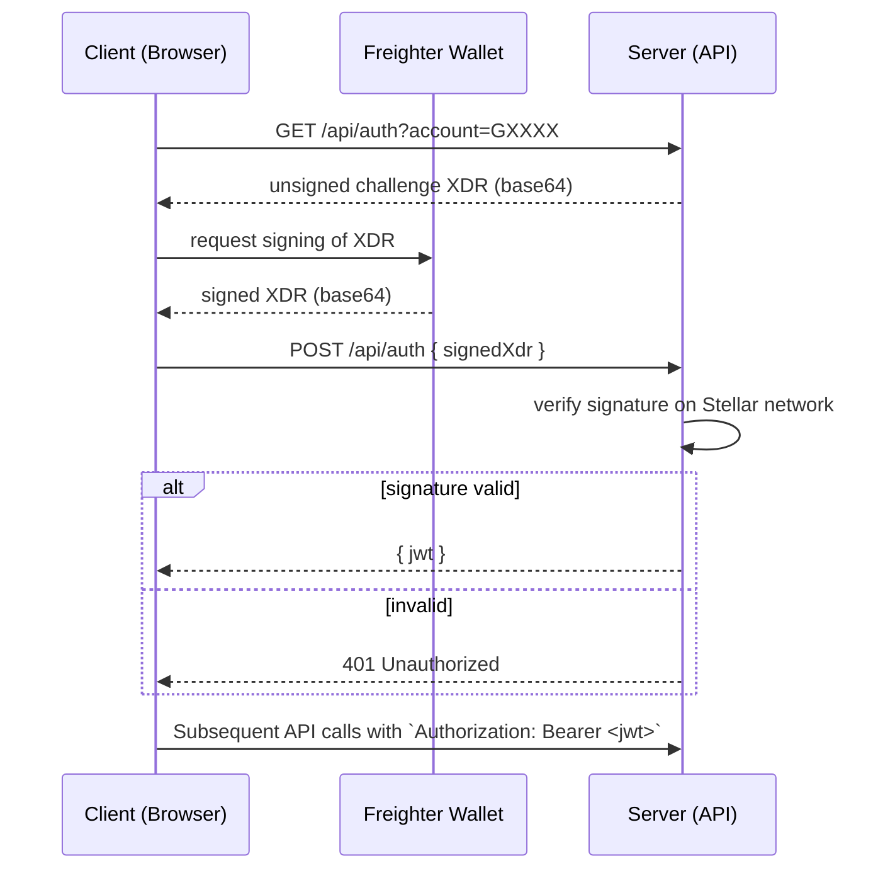

# Authentication Flow (Stellar SEP‑10)

**Table of Contents**
- [Overview](#overview)
- [SEP‑10 Standard](#sep-10-standard)
- [Flow Diagram](#flow-diagram)
- [Frontend Example (Freighter)](#frontend-example-freighter)
- [Backend Example (Node/Express)](#backend-example-nodeexpress)
- [Using the JWT](#using-the-jwt)
- [Common Questions](#common-questions)

---

## Overview
Stellar MarketPay uses **SEP‑10** – the Stellar standard for **challenge‑response authentication**. Instead of passwords or OAuth, a user proves ownership of a Stellar account by signing a server‑generated transaction (the *challenge*) with their wallet (e.g., **Freighter**). When the signature is verified on‑chain, the server issues a short‑lived **JWT** for subsequent API calls.

This flow is deliberately **stateless** on the backend: the server never stores private keys, and the JWT contains only a minimal set of claims (`sub`, `exp`, `iat`). It works equally well for developers familiar with Web2 auth and those coming from the Stellar ecosystem.

---

## SEP‑10 Standard
- Official specification: https://github.com/stellar/stellar-protocol/blob/master/ecosystem/sep-0010.md
- Key concepts:
  - **Challenge transaction** – an unsigned `TransactionEnvelope` (XDR) that includes a **nonce** and **home domain**.
  - **Signed XDR** – the client returns the same envelope, signed with the secret key of the account.
  - **Verification** – the server checks the signature against the public key on the Stellar network.

---

## Flow Diagram


---

## Frontend Example (Freighter)
```tsx
import { useRouter } from "next/router";

async function authenticate(account: string) {
  // 1️⃣ Request a challenge from the backend
  const challengeRes = await fetch(
    `${process.env.NEXT_PUBLIC_API_URL}/api/auth?account=${account}`
  );
  const { transaction } = await challengeRes.json(); // base64 XDR

  // 2️⃣ Ask Freighter to sign the XDR
  // eslint-disable-next-line @typescript-eslint/no-explicit-any
  const freighter = (window as any).freighter;
  if (!freighter) throw new Error("Freighter not installed");

  const signedXdr = await freighter.signTransaction(transaction);

  // 3️⃣ Send the signed XDR back to the server
  const loginRes = await fetch(
    `${process.env.NEXT_PUBLIC_API_URL}/api/auth`,
    {
      method: "POST",
      headers: { "Content-Type": "application/json" },
      body: JSON.stringify({ signedXdr }),
    }
  );

  if (!loginRes.ok) throw new Error("Authentication failed");
  const { token } = await loginRes.json();

  // 4️⃣ Store JWT (e.g., in httpOnly cookie or localStorage)
  localStorage.setItem("jwt", token);
}

// Usage (e.g., on "Connect Wallet" button)
export default function ConnectButton() {
  const router = useRouter();
  const connect = async () => {
    const freighter = (window as any).freighter;
    const account = await freighter.getPublicKey();
    await authenticate(account);
    router.reload(); // refresh UI now that we are logged in
  };

  return <button onClick={connect}>Connect with Freighter</button>;
}
```

---

## Backend Example (Node + Express)
```ts
import express from "express";
import { Server } from "stellar-sdk"; // v10+ includes SEP‑10 utilities
import jwt from "jsonwebtoken";

const app = express();
app.use(express.json());

const HORIZON_URL = "https://horizon-testnet.stellar.org";
const SERVER_HOME_DOMAIN = "stellar.marketpay.io"; // replace with your domain
const JWT_SECRET = process.env.JWT_SECRET || "super‑secret";

/** GET /api/auth?account=G… */
app.get("/api/auth", async (req, res) => {
  const { account } = req.query as { account?: string };
  if (!account) return res.status(400).json({ error: "account required" });

  // Build a SEP‑10 challenge transaction
  const challenge = await Server.fromEndpoint(HORIZON_URL).buildChallengeTx(
    account,
    SERVER_HOME_DOMAIN,
    Math.floor(Date.now() / 1000) + 300 // 5‑minute timeout
  );

  // Return the XDR (base64) to the client
  res.json({ transaction: challenge.toXDR("base64") });
});

/** POST /api/auth { signedXdr } */
app.post("/api/auth", async (req, res) => {
  const { signedXdr } = req.body as { signedXdr?: string };
  if (!signedXdr) return res.status(400).json({ error: "signedXdr required" });

  try {
    // Verify the signed challenge against the network
    const server = new Server(HORIZON_URL);
    const { clientAccountId } = await server.verifyChallengeTx(signedXdr);

    // Issue a JWT – include the Stellar public key as the subject
    const token = jwt.sign({ sub: clientAccountId }, JWT_SECRET, {
      expiresIn: "1h",
    });
    res.json({ token });
  } catch (e) {
    console.error("SEP‑10 verification error:", e);
    res.status(401).json({ error: "invalid signature" });
  }
});

/** Example protected endpoint */
app.get("/api/profile", (req, res) => {
  const auth = req.headers.authorization?.split(" ")[1];
  if (!auth) return res.status(401).json({ error: "no token" });

  try {
    const payload = jwt.verify(auth, JWT_SECRET) as { sub: string };
    // `payload.sub` is the Stellar address, use it to look up data
    res.json({ stellarAddress: payload.sub, /* … */ });
  } catch {
    res.status(401).json({ error: "invalid token" });
  }
});

app.listen(4000, () => console.log("Auth server listening on :4000"));
```

---

## Using the JWT
1. **Store** the token securely – an `httpOnly` cookie is recommended for production.
2. **Attach** it to every request that needs authentication:
   ```http
   Authorization: Bearer <jwt>
   ```
3. The backend can decode the JWT to obtain the **Stellar public key** (`sub` claim) and treat it as the authenticated identity.
4. Tokens are short‑lived (e.g., 1 hour). When they expire, the client simply repeats the SEP‑10 flow.

---

## Common Questions
### Why not use OAuth / passwords?
- **Password‑less** – users never create or share a secret with the app.
- **No credential storage** – the only secret lives in the user’s wallet.
- **Blockchain‑native** – the identity is a public Stellar address that can be used on‑chain.

### What is XDR?
XDR (External Data Representation) is a binary format used by Stellar for all network objects. The challenge transaction is serialized to XDR, Base64‑encoded for transport, and signed by the wallet.

### What if the user's wallet is compromised?
If an attacker obtains the private key, they can sign any transaction, including a new SEP‑10 challenge. This is equivalent to losing control of the Stellar account – the same risk as any blockchain asset. Users should **store their secret keys safely** and can rotate the account by creating a new Stellar address.

---

## Linking from the README
Add the following line to the project's README (e.g., under a "Documentation" heading):
```
📚 See the full authentication flow in [docs/auth-flow.md](docs/auth-flow.md).
```

---

*This document is intentionally concise but complete enough for contributors to implement, test, and extend the authentication flow.*
